## Client Requirements

+ A Profile of the company itself
+ Profiles of existing trainee web developers
+ Job specifications and required qualifications 
+ An on-line application form 
+ Links to web development courses 

## User Requirements

+ A website that will be easy to navigate
+ A website that will be able to read and understand
+ A website that loads in fast speeds
+ A resonsive website that will work on all devices

## Developer requirements

+ A website that is easy to maintain
+ A website that is easy to add new content
+ A website that is easy to understand

## Target Audience

The target audience for this website is people who are looking to get into web development or people that are already in web development. The website will help those who have completed degrees or got qualifications to be able to find a job in web development.

## File Structure

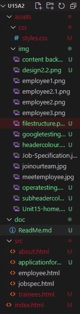

## Storyboard

I made two different designs with the same content however the layout is different. Theses are the two designs I made.

### Design 1

This is Design 1. This design is a simple design that will use images as buttons to be able to navigate to the different pages. I would like the images to be 325px by 325px in size with all 3 images. The navigation bar at the top will allow users to travel to the home, about and contact page from any page on the site. I went for a dark grey and a lighter grey for the headers and sub headers, and white background for the main content. I also added a footer at the bottom of the page. As the background of the website is white, the black text on the white is going to make it easy to read and will have a nice contrast. 

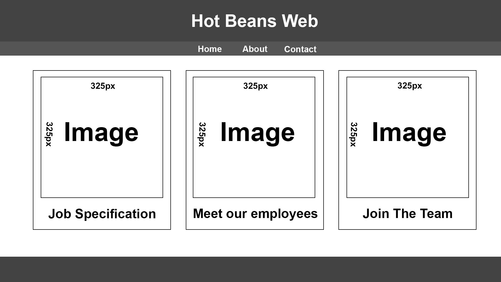

### Design 2

When it came to design 2, I wanted to make the website completely different layout to really have a contrast between the two designs. I went for a design that uterlised a carousel on the home page to show the different pages that the user can navigate to. The about me is on the home page so user can immediatly be able to read about the company first. The application form can be navigated to by clicking on the top left button on the navigation bar. 

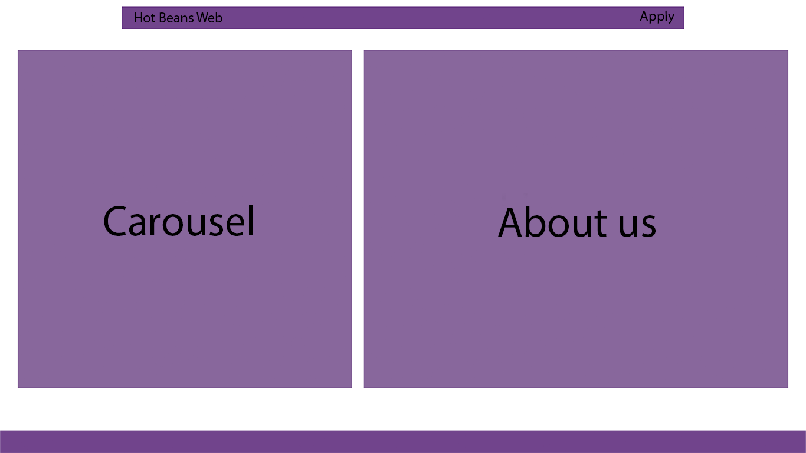

### Which design did I choose?

I believe that the design 1 is the best design to go with as it feel like it will meet the clients requirements and the users requirements. The design is simple and easy to navigate. The design is also going to stay consistent throughout the website with the header never changing, the footer staying consistent as well, this will make the website smoother to operate as the content in the middle will be the only thing that will change troughout the website. Using Carousels in the design will also mean the use of less pages meaning not as much moving between different pages

## Design details

The colour for the header and the header is #333333 and the main content is #f0f0f0. The footer is #333333. The sub header is colour #444444, The font I used is Arial.  

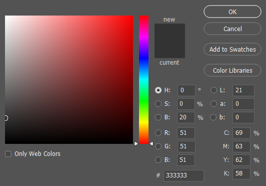

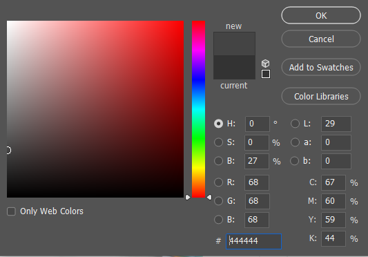

The font of the website will primary be using Arial in a black colour as it is easiest to see on the grey and white background colours. As show by the storyboard all the images of the website will be all be 325px by 325px. The images will be used as buttons to navigate to the different pages on the website.

The "Join Our Team" page will have a carousel that will have all the details of the job description and responsibilities of the job. The carousel will also have a button that will allow the user to apply for the job and take then to the application page. The carousel will also have a button that will allow the user to navigate to the "Job Specification" page.

## Navigation Map

This is the navigation map for the website. This will show how the navigation on the website will work and where certain pages can lead to. If the column or the row for the page is empty, that means that the page cannot be navigated to from that page however if there is a "/" in the column or the row, that means that the page can be navigated to from that page.

| Navigation         | Home | About | Apply | Join our team | Job specification | Meet our employees |
|--------------------|------|-------|-------|---------------|-------------------|--------------------|
| Home               | /    | /     | /     | /             | /                 | /                  |
| About              | /    | /     | /     |               |                   |                    |
| Apply              | /    | /     | /     |               |                   |                    |
| Join our team      | /    | /     | /     |               | /                 |                    |
| Job Specification  | /    | /     | /     | /             |                   |                    |
| Meet our employees | /    | /     | /     |               |                   |                    |

## Testing

I will be testing the website to make sure that all the links, imgs, text and CSS is all working as intented and will work when the website is live. I will also be testing the website on different web browsers to make sure that the website will be able to work on all web browsers.

I have done some testing with each of the versions of the web page and i have reported the issues and the fixes that I have done to the website. 

### OperaGX

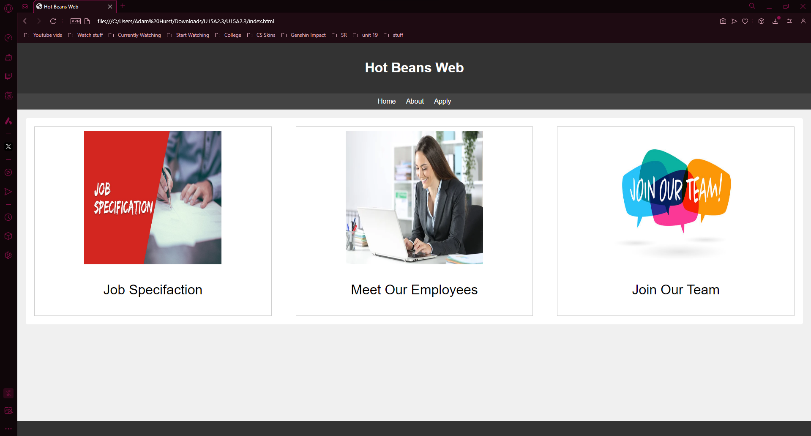

### Google Chrome 

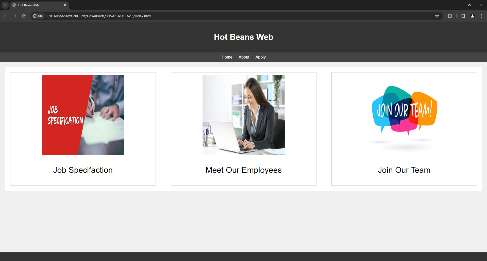

### Home page

#### Desktop computer

|                     | Navigation Links | Imgs | Font Size | Header | Footer | Containers |
|---------------------|------------------|------|-----------|--------|--------|------------|
| Working as intended | /                | /    | /         | /      | /      | /          |

#### Mobile

|                     | Navigation Links | Imgs | Font Size | Header | Footer | Containers |
|---------------------|------------------|------|-----------|--------|--------|------------|
| Working as intended | /                |      | /         | /      | /      |            |

When on a mobile device, the images are overlaping each other. This is also true with the containers.

### About page

#### Desktop computer

|                     | Navigation Links | Font Size | Header | Footer | Containers |
|---------------------|------------------|-----------|--------|--------|------------|
| Working as intended | /                | /         | /      | /      | /          |

#### Mobile

|                     | Navigation Links | Font Size | Header | Footer | Containers |
|---------------------|------------------|-----------|--------|--------|------------|
| Working as intended | /                | /         | /      | /      | /          |

### Job Specification page

#### Desktop computer

|                     | Navigation Links | Font Size | Header | Footer | Containers |
|---------------------|------------------|-----------|--------|--------|------------|
| Working as intended | /                | /         | /      | /      | /          |

#### Mobile

|                     | Navigation Links | Font Size | Header | Footer | Containers |
|---------------------|------------------|-----------|--------|--------|------------|
| Working as intended | /                | /         | /      | /      | /          |

### Apply page

#### Desktop computer

|                     | Navigation Links | Font Size | Header | Footer | Containers |
|---------------------|------------------|-----------|--------|--------|------------|
| Working as intended | /                | /         | /      | /      | /          |

#### Mobile

|                     | Navigation Links | Font Size | Header | Footer | Containers |
|---------------------|------------------|-----------|--------|--------|------------|
| Working as intended | /                | /         | /      | /      |            |

When on a mobile device the container that holds the registration form is not working as intended. it is overlapping the container it is contained in.

### Meet our employees page

#### Desktop computer

|                     | Navigation Links | Imgs | Font | Header | Footer |
|---------------------|------------------|------|------|--------|--------|
| Working as intended | /                | /    | /    | /      | /      |

#### Mobile

|                     | Navigation Links | Imgs | Font | Header | Footer |
|---------------------|------------------|------|------|--------|--------|
| Working as intended | /                | /    | /    | /      | /      |

### Testing Results

The website is working as intended on the desktop computer. However when on a mobile device, the website is not working as intended. The images are overlapping each other and the containers are overlapping each other. The registration form on the apply page is also not working as intended.

### Performance Testing 

The website scored 100% on the performance test in multiple different country's. This means that the website is going to be able to load in fast speeds in different country's. I used the website [Lighthouse Metrics](https://lighthouse-metrics.com/lighthouse/checks/44df16f0-8e18-420c-a414-81b165da7916) to test the performance of the website.

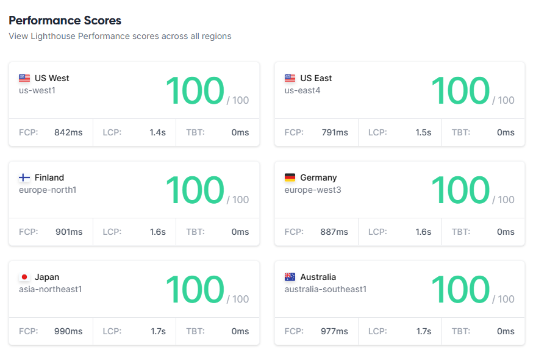

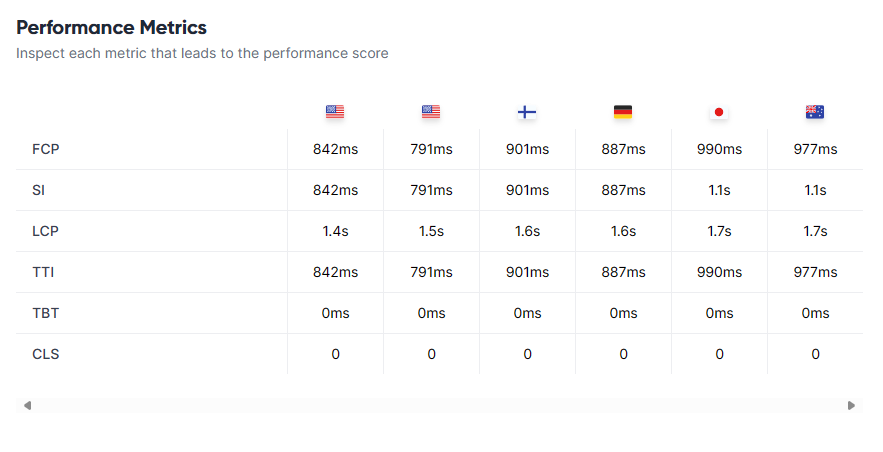

### Mobile Testing 

### Usability Testing

When testing the usability I wanted to ask people that had never seen my site to test it to see how useable and accessible all the information.

#### Aiden Scowen

"I think the website is very easy to navigate and the layout is very simple. The colour scheme is pleasing to the eye and the font doesnt look out of place. One major flaw is that the websites "About Us" page is looking empty and could do with some more content."

#### Ugnius Mieldazys

"The Colour scheme is very nice and the website is very nice and easy to navigate around. The font looks nice and contrasts well with the background. One of the things i would improve is that the carousel button to change the page its on is hard to see has it has no background and the colour is white so it blends in with the background."

### Changes based on feedback 

#### Aiden Scowen Feedback

I added more content to the "About Us" page to make it look less empty. I did this by adding more information about the site and an youtube video showing what a day in the life of a web developer is like.

#### Before

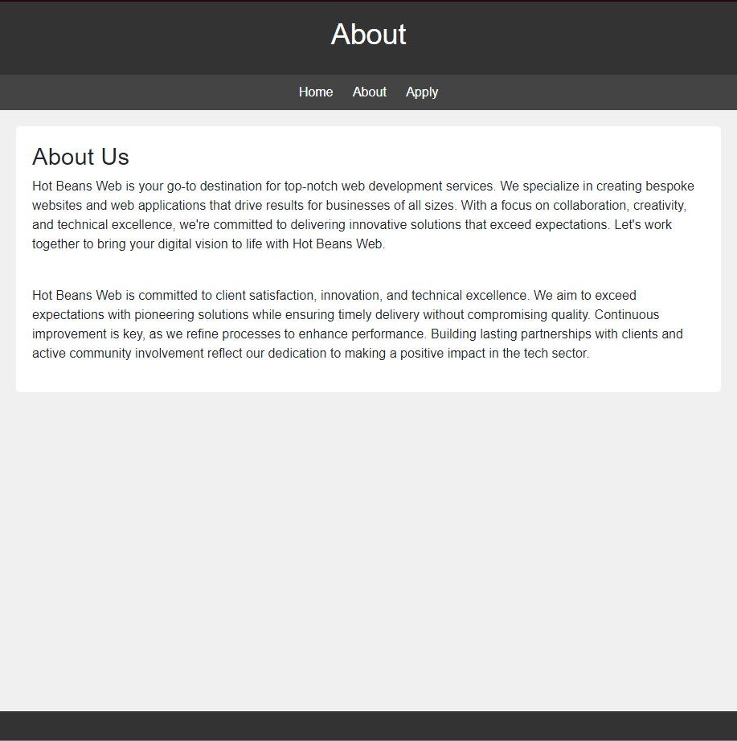

#### After

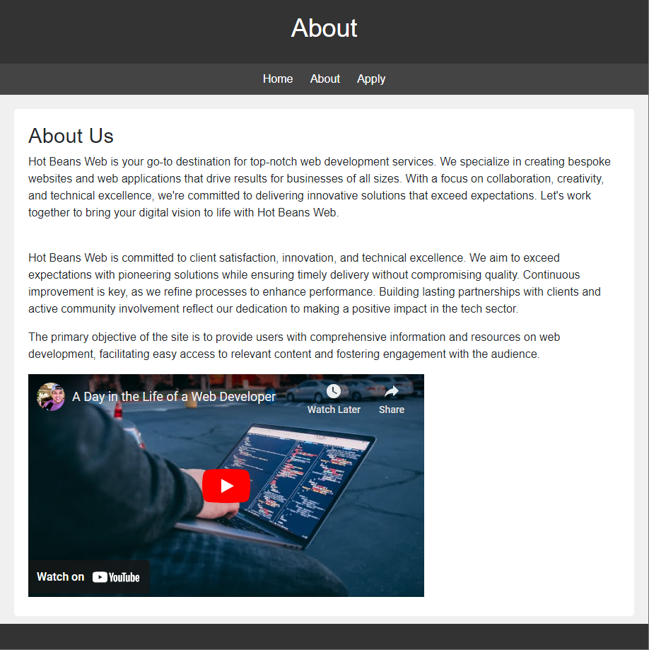

#### Ugnius Mieldazys Feedback

I have made the button for the carousel more visable by changing the background colour of it to a dark grey.

#### Before

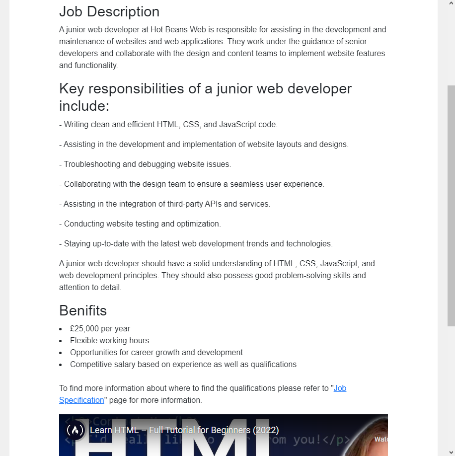

#### After 

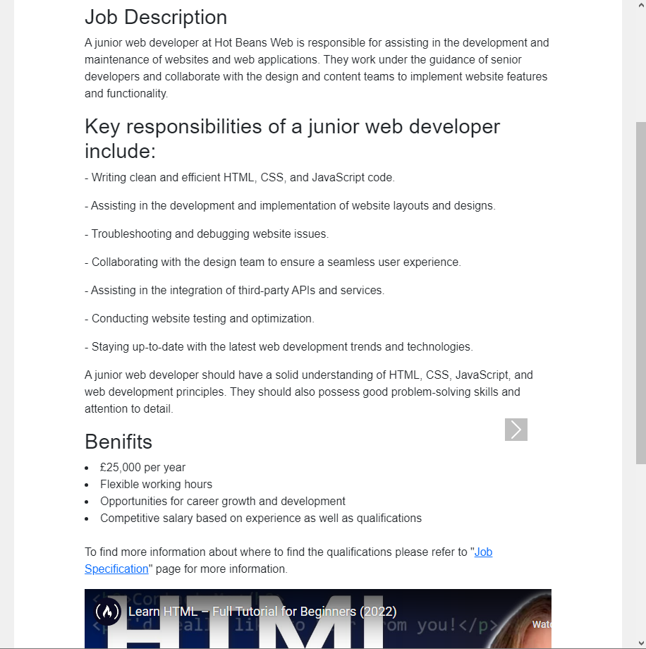

## Evaluation

### Design 

The website is designed to meet the client as well as the users requirements. One way it does this is by making sure that the websites layout is easy to use as a user of the site otherwise. Making sure that the user is able to navigate to the different pages on the website quickly and easily, will overall improve and make the website more user friendly. Another way that is met the client requirements is by making the colour scheme as it was important to make them look nice as well as not being to harsh on the eyes. 

The second way that I have met the requirements is by making sure that I have linked courses as the clients requested that we have "Links to web development courses" on our website. I have placed theses in the "Join our team" page as I believe that this is the best place to put them. Additionally the website is reponsive and is working well shown by the performance test that I have done. This will allow the website to be used accross multiple different browers and devices. Additionally the client requested that we have "Profiles of existing trainee web developers" which can be found on the "Meet our employees" page.

Overall my website meets alot of the user requirements and the client requirements.

### Optimisation

Once the development process was done I conducted alot of testing in alot of different areas such as performance, loading, and making sure the CSS is appearing as intended. This included me testing that the site would work on different web browsers and devices, it works on all web browsers however it doesnt work on mobile devices. 

Furthermore when it comes to making sure that the site work accross multple browsers it is working as intended out however it the site doesnt work as intended when using smaller devices such as phones. One area that I found troubling was the bootstrap as it is not something that I perticularly use so I found it differcult to use. However building this website has strengthened my skills in using bootstrap and I will be able to use it in the future.

## Changes

### Image sizing

One of the issues with my site was the fact the website home screen images was not working as intended, the images looked stretched and distored however I created some new images that was made in the size format I wanted which is 325px x 325px this way the images wouldnt look stretched. This enchances the user experience as well as the achieveing the clients requirements. 

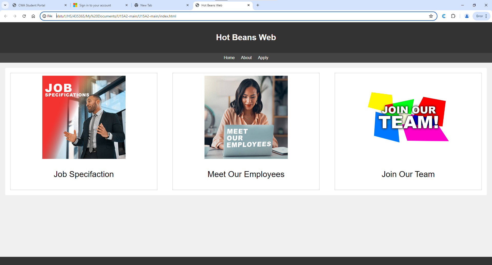

### Resizing Issue

When resizing the webpage the images would overlap the container they are in as well as over lap over images. This issue was fixed by simply changing the height to auto as the images are already the size I wish them to be. This will enhance the experience for a mobile user and for using the website in windowed mode.

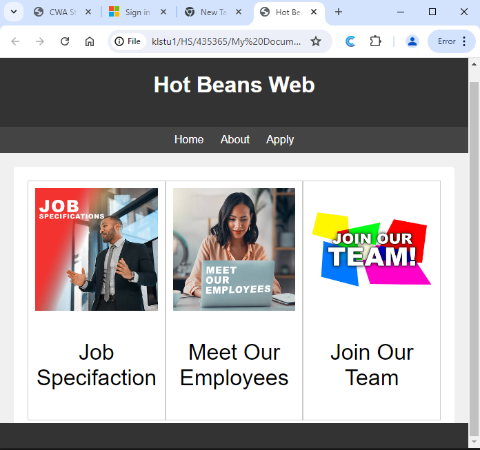

### Application Form

The application forms boxes had no border meaning it was hard to tell where to click when trying to use the application form. I have changed the way it looks as well as the way it has been formated. This will add to the user experience. 

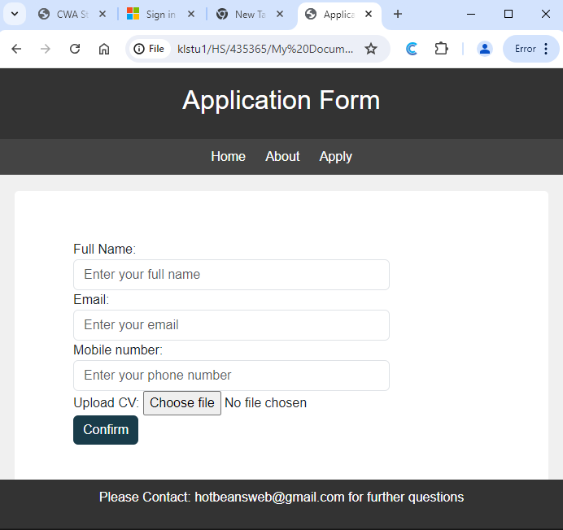

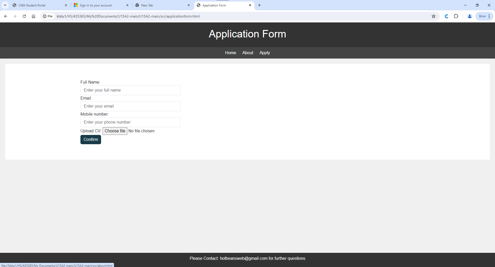

